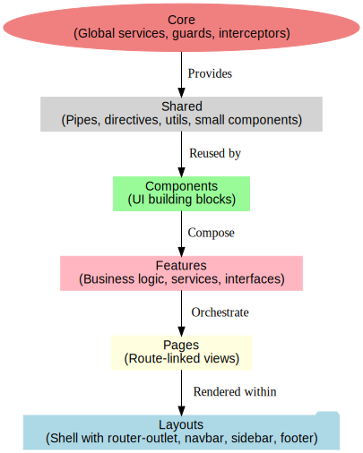
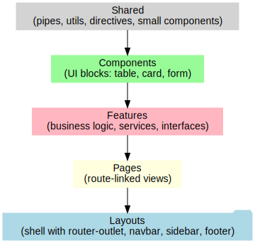

# VucemProject

This project was generated with [Angular CLI](https://github.com/angular/angular-cli) version 17.3.17.

## Development server

Run `ng serve` for a dev server. Navigate to `http://localhost:4200/`. The application will automatically reload if you change any of the source files.

## Code scaffolding

Run `ng generate component component-name` to generate a new component. You can also use `ng generate directive|pipe|service|class|guard|interface|enum|module`.

## Build

Run `ng build` to build the project. The build artifacts will be stored in the `dist/` directory.

## Running unit tests

Run `ng test` to execute the unit tests via [Karma](https://karma-runner.github.io).

## Running end-to-end tests

Run `ng e2e` to execute the end-to-end tests via a platform of your choice. To use this command, you need to first add a package that implements end-to-end testing capabilities.

## Further help

To get more help on the Angular CLI use `ng help` or go check out the [Angular CLI Overview and Command Reference](https://angular.io/cli) page.

---

# 🏗️ Clean Architecture en Angular

Este proyecto sigue una **Clean Architecture enfocada a Angular**,
lo que permite mantener el código organizado en capas claras y desacopladas:
**Core, Shared, Components, Features, Pages y Layouts**.

---

## 📂 Estructura de Carpetas

```bash
src/app
│
├── ⚙️ core/                     # Código global de la app, no depende de features
│   └── 🛠️ services/             # Servicios base (auth, api, logger, etc.)
│
├── ♻️ shared/                   # Reutilizable en toda la app
│   ├── 🔧 components/           # Componentes genéricos (table, modal, button)
│   ├── 📑 interfaces/           # Interfaces comunes y tipados globales
│   ├── 🧩 utils/                # Helpers y funciones utilitarias (ej: formUtils)
│   ├── 🔠 pipes/                # Pipes reutilizables (ej: date-format.pipe)
│   └── ✨ directives/           # Directivas personalizadas (ej: autofocus)
│
├── 📦 features/                 # Dominios funcionales de negocio
│   ├── 📊 consultas/            # Todo lo relacionado a consultas
│   │   ├── 📂 consultas-recintos/   # Submódulo de consultas específicas
│   │   ├── 📂 manifiesto-aereo/     # Submódulo con pages, components y services
│   │   └── 🗺️ consultas.routes.ts   # Definición de rutas del módulo
│   │
│   └── 📑 tramites/             # Todo lo relacionado a trámites
│
├── 🏪 store-front/              # Capa de entrada principal de la app
│   ├── 🔧 components/           # Ej: navbar, sidebar
│   ├── 📑 interfaces/           # Interfaces propias del store-front
│   ├── 🗂️ layout/               # Layout principal (estructura de la vista)
│   ├── 📄 pages/                # Páginas principales (home, consultas, not-found)
│   └── 🗺️ routes/               # Rutas específicas del store-front
│
├── 🏠 app.component.*           # Componente raíz de Angular
├── 🗺️ app.routes.ts             # Rutas globales de la aplicación
└── ⚙️ app.config.ts             # Configuración general de la app
```

---

## ✅ Descripción rápida de cada carpeta

- **core/** → Lógica global (servicios base, guards, interceptors).
- **shared/** → Reutilizable: componentes pequeños, pipes, directivas, utils.
- **features/** → Dominios de negocio (ej: consultas, trámites).
- **store-front/** → Entrada principal, layout, navegación y páginas generales.
- **app.component / routes / config** → Configuración y bootstrap de la app.

---

## 📊 Diagrama Clean Architecture (Angular)



### Versión ASCII

```text
          ⚙️ Core
 (Servicios globales, Guards, Interceptors)
                    │
                    ▼
            ♻️ Shared (utils, pipes, directives)
                    │
                    ▼
          🔧 Components (UI building blocks)
                    │
                    ▼
        📦 Features (Consultas, Trámites, etc.)
                    │
                    ▼
            📄 Pages (Home, Consultas, Trámites)
                    │
                    ▼
        🗂️ Layouts (Store-Front, Admin, Auth)
```

---

## 📊 Diagrama de Capas (Shared → Components → Features → Pages → Layouts)

```text
♻️ Shared → 🔧 Components → 📦 Features → 📄 Pages → 🗂️ Layouts
```



---

📌 Con esta arquitectura:

- **Shared** provee piezas reutilizables.
- **Components** construyen bloques de UI.
- **Features** encapsulan lógica de negocio.
- **Pages** representan pantallas asociadas a rutas.
- **Layouts** definen la estructura global y muestran las Pages.
