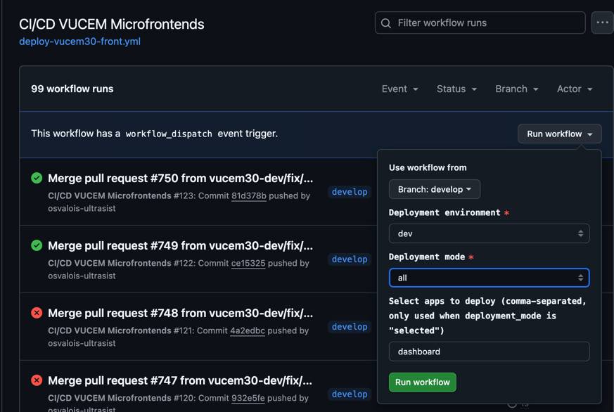

<strong>Manual de Configuración CI/CD</strong>  
**Versión de documento:** 1.0  
**Fecha:** 25 de marzo de 2025  
**Clasificación:** CONFIDENCIAL  
**Preparado por:** Equipo de arquitectura  
**Aprobado por:** Pendiente

---
# Manual de Operación del Workflow CI/CD de Microfrontends VUCEM

Este manual explica cómo utilizar el workflow de CI/CD para los microfrontends de VUCEM en entornos de desarrollo, staging y producción.

## Contenido

1. [Introducción](#introducción)
2. [Modos de Despliegue](#modos-de-despliegue)
3. [Despliegue Automático](#despliegue-automático)
4. [Despliegue Manual](#despliegue-manual)
5. [Verificación de Despliegues](#verificación-de-despliegues)
6. [Solución de Problemas](#solución-de-problemas)

## Introducción

El workflow de CI/CD para VUCEM Microfrontends permite construir y desplegar aplicaciones de forma automática cuando se detectan cambios en el código, o manualmente a través de la interfaz de GitHub Actions. El sistema está diseñado para ser flexible y adaptarse a diferentes necesidades de desarrollo y despliegue.

### Aplicaciones Disponibles

El sistema gestiona las siguientes aplicaciones:

- dashboard
- login
- aga
- agricultura
- se
- semarnat
- agace
- funcionario
- cofepris
- amecafe
- inbal

## Modos de Despliegue

El workflow ofrece tres modos de despliegue:

1. **Modo "changed"**: Despliega solo las aplicaciones que han tenido cambios en el código.
2. **Modo "selected"**: Permite seleccionar manualmente qué aplicaciones desplegar.
3. **Modo "all"**: Despliega todas las aplicaciones disponibles.

## Despliegue Automático

El despliegue automático se activa cuando se hace push a las ramas `develop` o `main`, y se detectan cambios en las siguientes rutas:

- `apps/**` (cambios en aplicaciones específicas)
- `libs/**` (cambios en librerías compartidas)
- `docker/**` (cambios en configuraciones de Docker)
- `package.json`
- `nx.json`
- `.github/workflows/**`

### Cómo Funciona el Despliegue Automático

1. El sistema identifica los archivos que han cambiado desde el último commit.
2. Detecta a qué aplicación pertenecen estos cambios.
3. Si detecta cambios en librerías compartidas (`libs/shared/`), todas las aplicaciones se marcarán para reconstrucción.
4. El dashboard siempre se incluye cuando cualquier otra aplicación ha cambiado.
5. Las aplicaciones detectadas se construyen y despliegan en el entorno correspondiente.

### Entornos de Despliegue Automático

- Rama `develop`: Se despliega al entorno de `dev`
- Rama `main`: Se despliega al entorno de `prod`

## Despliegue Manual

Para realizar un despliegue manual:

1. Ve a la pestaña "Actions" en el repositorio de GitHub.
2. Selecciona el workflow "CI/CD VUCEM Microfrontends".
3. Haz clic en "Run workflow".
4. Se mostrará un formulario con las siguientes opciones:

### Opciones de Configuración

- **Deployment environment** (Obligatorio):
    - `dev`: Entorno de desarrollo
    - `staging`: Entorno de pruebas
    - `prod`: Entorno de producción

- **Deployment mode** (Obligatorio):
    - `changed`: Despliega solo las aplicaciones con cambios detectados
    - `selected`: Despliega solo las aplicaciones que especifiques
    - `all`: Despliega todas las aplicaciones

- **Selected apps** (Opcional):
    - Campo de texto para especificar las aplicaciones a desplegar
    - Usado solo cuando el modo es "selected"
    - Formato: lista separada por comas (ej: "dashboard,login,aga")

### Ejemplos de Uso

**Ejemplo 1: Desplegar solo las aplicaciones que han cambiado en desarrollo**

- Deployment environment: `dev`
- Deployment mode: `changed`
- Selected apps: (dejar en blanco)

**Ejemplo 2: Desplegar específicamente login y aga en staging**

- Deployment environment: `staging`
- Deployment mode: `selected`
- Selected apps: `login,aga`

**Ejemplo 3: Desplegar todas las aplicaciones en producción**

- Deployment environment: `prod`
- Deployment mode: `all`
- Selected apps: (dejar en blanco)

## Verificación de Despliegues

Para verificar que el despliegue se ha realizado correctamente:

1. Monitorea el progreso del workflow en la pestaña "Actions" de GitHub.
2. Verifica que todos los jobs (setup, build, deploy) se completen con éxito.
3. Accede a la aplicación en el entorno correspondiente:
    - Desarrollo: `https://vucem-dev.example.com`
    - Staging: `https://vucem-staging.example.com`
    - Producción: `https://vucem-prod.example.com`

## Solución de Problemas

### El workflow se completa pero no se despliega nada

**Posible causa**: No se detectaron cambios en las aplicaciones y el modo de despliegue era "changed".

**Solución**: Ejecuta el workflow manualmente y selecciona el modo "selected" o "all".

### El job "Build Microfrontends" se salta

**Posible causa**: No se detectaron aplicaciones para construir o la lista de aplicaciones está vacía.

**Solución**: Verifica que las aplicaciones seleccionadas existan y estén correctamente escritas en el campo "Selected apps".

### Errores durante el build

**Posible causa**: Problemas con el código o dependencias.

**Solución**:
1. Revisa los logs de error en el job "Build Microfrontends".
2. Corrige los problemas en el código.
3. Realiza un nuevo commit o ejecuta el workflow manualmente.

### Errores durante el despliegue

**Posible causa**: Problemas con la configuración de Kubernetes o secretos.

**Solución**:
1. Verifica los secretos en la configuración del repositorio (REMOTE_SRV_IP, REMOTE_SRV_USER, REMOTE_SRV_PRIV_KEY).
2. Revisa los logs del job "Deploy Microfrontends".
3. Contacta al administrador del cluster Kubernetes si persisten los problemas.

**© 2025 Servicio de Administración Tributaria - Todos los derechos reservados**  
**VUCEM 3.0 - Ventanilla Única de Comercio Exterior Mexicano**  
**Av. Hidalgo 77, Col. Guerrero, C.P. 06300, Ciudad de México**

